# 🧠 Mastermind Software Engineer Guide (Personal Edition)

<details>
<summary><strong>🚀 My Tech Stack</strong></summary>

- **Backend**: Python (Django, FastAPI), Rust (actix-web, axum)
- **Frontend**: Svelte / SvelteKit
- **Tools**: Linux, Git, Docker
- **Patterns & Principles**: SOLID, DRY, YAGNI, KISS, naming, architecture, extendibility

</details>

---


## 🟢 Foundational Knowledge (Must Always Keep Warm)

<details>
<summary><strong>✅ Data Structures & Algorithms (DSA)</strong></summary>

- Arrays, Linked Lists, Trees, Graphs
- Sorting, Searching
- Hash Maps, Sets
- Recursion, Dynamic Programming (DP)
- Time & Space Complexity (Big O)

**Tip**: Revise once per year — but don’t overstress memorization. Deep pattern recognition is more important.

</details>

<details>
<summary><strong>✅ Core Principles</strong></summary>

- **SOLID** (OOP principles)
- **DRY** (Don’t Repeat Yourself)
- **KISS** (Keep It Simple, Stupid)
- **YAGNI** (You Ain’t Gonna Need It)

</details>


---
<br><br>
## 🟠 LeetCode Patterns for DSA
<details>
<summary>Mastering these patterns helps you solve most coding interview problems efficiently:
</summary>


- **Sliding Window**  
  For subarrays/substrings with optimal time (e.g., max sum, longest substring).
  - Example: Maximum Subarray, Longest Substring Without Repeating Characters

- **Two Pointers**  
  For problems on sorted arrays/linked lists (e.g., pair sum, reverse).
  - Example: Two Sum II, Remove Duplicates from Sorted Array

- **Fast & Slow Pointers (Cycle Detection)**  
  Detect cycles or find middle in linked lists.
  - Example: Linked List Cycle, Find Middle of Linked List

- **Merge Intervals**  
  For interval overlap/merge problems.
  - Example: Merge Intervals, Insert Interval

- **Binary Search**  
  For sorted arrays/search space reduction.
  - Example: Search in Rotated Sorted Array, Find Minimum in Rotated Sorted Array

- **Backtracking**  
  For permutations, combinations, and subsets.
  - Example: Subsets, Permutations, Combination Sum

- **Breadth-First Search (BFS)**  
  For shortest path in unweighted graphs/trees.
  - Example: Binary Tree Level Order Traversal, Word Ladder

- **Depth-First Search (DFS)**  
  For traversals, connected components, and recursion.
  - Example: Number of Islands, Clone Graph

- **Dynamic Programming (DP)**  
  For optimal substructure/overlapping subproblems.
  - Example: Climbing Stairs, House Robber, Longest Increasing Subsequence

- **Greedy**  
  For local optimal → global optimal.
  - Example: Jump Game, Gas Station

- **Heap/Priority Queue**  
  For top K elements, merging sorted lists.
  - Example: Kth Largest Element, Merge K Sorted Lists

- **Trie**  
  For prefix-based search.
  - Example: Implement Trie, Word Search II

**Tip:**  
Focus on understanding the pattern, not just the solution.  
[LeetCode Patterns Reference](https://seanprashad.com/leetcode-patterns/)

</details>


---
<br><br>

## 📐 Software Design & Architectural Patterns


<strong>📄 Overview</strong>

Design and architectural patterns are tried-and-true solutions to common software development problems. They help write clean, maintainable, and scalable code.

>

<details>
<summary><strong>🧱 1. Design Patterns</strong></summary>

<details>
<summary><strong>🔨 1.1 Creational Patterns</strong></summary>

- **Singleton**  
  Ensure a class has only one instance and provide a global point of access.
  ```mermaid
  classDiagram
  class Singleton {
    -instance: Singleton
    +getInstance(): Singleton
  }
  ```

- **Factory Method**  
  Define an interface for creating an object, but let subclasses decide which class to instantiate.
  ```mermaid
  classDiagram
  class Product
  class ConcreteProduct
  class Creator {
    +factoryMethod(): Product
  }
  class ConcreteCreator {
    +factoryMethod(): Product
  }
  Creator <|-- ConcreteCreator
  Product <|-- ConcreteProduct
  ```

- **Builder**  
  Separate the construction of a complex object from its representation.
  ```mermaid
  classDiagram
  class Director
  class Builder {
    +setPart()
    +getResult()
  }
  Director --> Builder
  ```

- **Prototype**  
  Create new objects by copying an existing object (clone).
  ```mermaid
  classDiagram
  class Prototype {
    +clone(): Prototype
  }
  class ConcretePrototype
  Prototype <|-- ConcretePrototype
  ```

</details>

<details>
<summary><strong>🧩 1.2 Structural Patterns</strong></summary>

- **Adapter**  
  Allow incompatible interfaces to work together.
  ```mermaid
  classDiagram
  class Target
  class Adaptee
  class Adapter
  Target <|.. Adapter
  Adapter --> Adaptee
  ```

- **Bridge**  
  Separate abstraction from implementation so they can vary independently.
  ```mermaid
  classDiagram
  class Abstraction
  class Implementor
  class RefinedAbstraction
  Abstraction <|-- RefinedAbstraction
  RefinedAbstraction --> Implementor
  ```

- **Composite**  
  Treat individual objects and compositions uniformly.
  ```mermaid
  classDiagram
  class Component
  class Leaf
  class Composite {
    +add()
  }
  Component <|-- Leaf
  Component <|-- Composite
  Composite --> Component
  ```

- **Decorator**  
  Add responsibilities to objects dynamically.
  ```mermaid
  classDiagram
  class Component
  class ConcreteComponent
  class Decorator
  class ConcreteDecorator
  Component <|-- ConcreteComponent
  Component <|-- Decorator
  Decorator <|-- ConcreteDecorator
  Decorator --> Component
  ```

- **Facade**  
  Provide a simplified interface to a complex subsystem.
  ```mermaid
  classDiagram
  class Facade
  class SubsystemA
  class SubsystemB
  Facade --> SubsystemA
  Facade --> SubsystemB
  ```

</details>

<details>
<summary><strong>🧠 1.3 Behavioral Patterns</strong></summary>

- **Observer**  
  Define a dependency between objects so that when one changes, others are notified.
  ```mermaid
  classDiagram
  class Subject {
    +attach()
    +detach()
    +notify()
  }
  class Observer {
    +update()
  }
  Subject --> Observer
  ```

- **Command**  
  Encapsulate a request as an object.
  ```mermaid
  classDiagram
  class Command {
    +execute()
  }
  class ConcreteCommand
  class Invoker
  class Receiver
  Command <|-- ConcreteCommand
  Invoker --> Command
  ConcreteCommand --> Receiver
  ```

- **Strategy**  
  Define a family of algorithms, encapsulate them, and make them interchangeable.
  ```mermaid
  classDiagram
  class Context {
    -strategy: Strategy
  }
  class Strategy {
    +execute()
  }
  class ConcreteStrategyA
  Strategy <|-- ConcreteStrategyA
  Context --> Strategy
  ```

</details>
</details>

<details>
<summary><strong>🏛️ 2. Architectural Patterns</strong></summary>

- **MVC (Model-View-Controller)**  
  Separates application logic into three interconnected components.
  ```mermaid
  graph TD
  Model --> Controller
  Controller --> View
  View --> Model
  ```

- **MVVM (Model-View-ViewModel)**  
  Enhances MVC with two-way binding between view and view model.
  ```mermaid
  graph TD
  Model --> ViewModel
  ViewModel --> View
  View --> ViewModel
  ```

- **Layered Architecture**  
  Organizes code into layers with specific responsibilities.
  ```mermaid
  graph TD
  UI --> Application
  Application --> Domain
  Domain --> Infrastructure
  ```

- **Client-Server**  
  Divide systems into a server (provider) and client (consumer).
  ```mermaid
  graph TD
  Client -->|Request| Server
  Server -->|Response| Client
  ```

- **Microservices**  
  Decompose a system into small, independently deployable services.
  ```mermaid
  graph TD
  ServiceA --> API
  ServiceB --> API
  ServiceC --> API
  API --> Client
  ```

</details>

<details>
<summary><strong>✅ Summary Table</strong></summary>

| Category |	Patterns|
|-|-|
| Creational |	Singleton, Factory Method, Builder, Prototype|
| Structural |	Adapter, Composite, Facade, Bridge, Decorator|
| Behavioral |	Observer, Command, Strategy|
| Architectural |	MVC, MVVM, Layered, Client-Server, Microservices|

</details>


---
<br><br>

## 📘 UML Diagrams with Mermaid.js

This document showcases the most common UML diagram types using Mermaid.js. Great for visualizing systems directly in GitHub markdown!

<details>
<summary><strong>🧱 1. Class Diagram</strong></summary>

**Description:**  
Class diagrams represent the structure of classes in a system, showing their attributes, methods, and relationships.


</details>

<details>
<summary><strong>🎭 2. Use Case Diagram</strong></summary>

**Description:**  
Use case diagrams visualize the interactions between users (actors) and the system to achieve goals (use cases).

```mermaid  
graph TD  
    Actor((👤 User)) -->|Uses| System[🖥️ System]  
    System --> UC1(📌 Use Case 1)  
    System --> UC2(📌 Use Case 2)  
    UC1 -.-> UC2  
```


</details>

<details>
<summary><strong>🔁 3. Sequence Diagram</strong></summary>

**Description:**  
Sequence diagrams show how objects or components interact in a particular sequence of time-ordered messages.


</details>

<details>
<summary><strong>🏃 4. Activity Diagram</strong></summary>

**Description:**  
Activity diagrams model the flow of control or data between activities, useful for describing workflows and logic.

```mermaid  
flowchart TD  
    Start([🚀 Start]) --> A[🔐 Login]  
    A --> B{✅ Valid?}  
    B -- Yes --> C[📊 Show Dashboard]  
    B -- No --> D[❌ Show Error]  
    C --> End([🏁 End])  
    D --> End  
```


</details>

<details>
<summary><strong>🔄 5. State Diagram</strong></summary>

**Description:**  
State diagrams represent the possible states of an object and transitions triggered by events or actions.

```mermaid  
stateDiagram-v2  
    [*] --> Idle  
    Idle --> Processing : ▶️ start()  
    Processing --> Finished : ✔️ complete()  
    Finished --> [*]  
```


</details>

<details>
<summary><strong>🧩 6. Component Diagram</strong></summary>

**Description:**  
Component diagrams model the components of a system and how they interact through interfaces.

```mermaid  
graph TB  
    Client[🧑‍💻 Client] -->|uses| API[🌐 API]  
    API --> Controller[🧭 Controller]  
    Controller --> Service[⚙️ Service]  
    Service --> Database[(🗄️ Database)]  
```


</details>

<details>
<summary><strong>🚚 7. Deployment Diagram</strong></summary>

**Description:**  
Deployment diagrams show the physical layout of hardware and how software components are deployed on them.

```mermaid  
graph TD  
    subgraph 🧑‍💻 Client Node  
        Browser[🌍 Browser]  
    end  

    subgraph 🖥️ Server Node  
        WebApp[🧠 WebApp]  
        DB[(🗃️ Database)]  
    end  

    Browser --> WebApp  
    WebApp --> DB  
```
</details>

<details>
<summary><strong>🧸 8. Object Diagram</strong></summary>

**Description:**  
Object diagrams depict instances of classes (objects) and their relationships at a specific point in time.


</details>


---
<br><br>


## 🔥 Next-Level Topics To Master (Architect Mindset)

<details>
<summary><strong>1️⃣ Architectural Styles</strong></summary>

- **Layered Architecture** (Controllers → Services → Repos)
- **Hexagonal Architecture** (Ports & Adapters, decouple domain)
- **CQRS** (Command Query Responsibility Segregation)
- **Event-Driven Architecture** (pub/sub systems, message queues)

</details>

<details>
<summary><strong>2️⃣ Domain-Driven Design (DDD)</strong></summary>

- Entities → objects with identity (e.g., `User`, `Order`)
- Value Objects → immutable, no ID (`Money`, `Coordinates`)
- Aggregates → groups of entities with a root
- Ubiquitous Language → name code after domain terms

</details>

<details>
<summary><strong>3️⃣ Advanced State Management (Frontend)</strong></summary>

- **Finite State Machines** → use XState or implement manually
- **Statecharts** → for complex UIs (multi-step flows)
- **Reactive Patterns** → data flow graphs, not just stores

</details>

<details>
<summary><strong>4️⃣ Testing Patterns</strong></summary>

- **Given-When-Then** (BDD style)
- **Test Doubles** (Mock, Stub, Fake)
- **Property-Based Testing** (e.g., `hypothesis` in Python, `proptest` in Rust)

</details>

---
<br><br>

## 🟢 Tools Every Mastermind Should Command

<details>
<summary><strong>✅ Git (Version Control)</strong></summary>

- Rebase, squash commits
- Feature branch workflows
- Writing meaningful commit messages
- Handling merge conflicts like a pro

</details>

<details>
<summary><strong>✅ Docker (Containers)</strong></summary>

- Writing multi-stage Dockerfiles
- Using `docker-compose` for dev envs
- Building minimal, production-ready images
- Understanding networks, volumes, healthchecks

</details>

<details>
<summary><strong>✅ Linux (Dev Environment)</strong></summary>

- Bash scripting
- `grep`, `awk`, `sed` for text processing
- Managing services with `systemd`
- Networking basics (`netstat`, `curl`, `dig`)

</details>

<details>
<summary><strong>✅ CI/CD (Optional but Highly Recommended)</strong></summary>

- Github Actions / Gitlab CI pipelines
- Lint → Test → Build → Deploy sequences
- Using Docker in CI pipelines

</details>


---


<br><br>

## 🌐 Clean API Development Guide (General & REST Focus)


<details>
<summary><strong>🚀 Goals of Clean API Design</strong></summary>

- **Consistent** → predictable patterns everywhere
- **Simple** → easy for clients to understand & use
- **Versioned** → changes don't break old clients
- **Secure** → protects against common vulnerabilities
- **Extensible** → easy to add features without breaking old ones
- **Well-documented** → clear and accurate API docs

</details>

<details>
<summary><strong>🔥 General API Design Principles (Always Apply)</strong></summary>

<details>
<summary>1. Use Meaningful Resource Naming</summary>

- Use **nouns** for resources, **verbs** for actions.
- Examples:
    ```
    GET /users
    POST /users
    PATCH /users/{id}
    ```

</details>

<details>
<summary>2. Use HTTP Methods Correctly</summary>

| Method  | Use For                   |
|---------|---------------------------|
| GET     | Retrieve data             |
| POST    | Create new resource       |
| PUT     | Replace entire resource   |
| PATCH   | Update part of resource   |
| DELETE  | Remove resource           |

</details>

<details>
<summary>3. Version Your API (Always!)</summary>

- Example:
    ```
    /api/v1/users
    /api/v2/users
    ```
- Use URI versioning or headers, but **always version**.

</details>

<details>
<summary>4. Use Standard HTTP Status Codes</summary>

| Status Code  | Meaning              |
|--------------|----------------------|
| 200 OK       | Success               |
| 201 Created  | Resource created      |
| 400 Bad Request | Client error       |
| 401 Unauthorized | Auth failed       |
| 404 Not Found | Resource missing     |
| 500 Server Error | Internal fail     |

</details>

<details>
<summary>5. Keep Responses Consistent</summary>

- Use a common envelope format:
```json
{
  "data": { ... },
  "error": null
}
```
https://swagger.io/
</details>
</details>
</details>

---
<br><br>
<br><br>

## 🟣 My Personalized Pattern Map (Cheat Sheet)

| When I do this...                             | It's called...         |
|-----------------------------------------------|------------------------|
| Pick components/classes based on condition    | **Factory Pattern**    |
| Wrap external APIs/components to fit my code  | **Adapter Pattern**    |
| Add features without changing base logic      | **Decorator Pattern**  |
| Build objects/config step by step             | **Builder Pattern**    |
| Split big things into smaller units           | **Single Responsibility** |
| Centralize shared state across many parts     | **Mediator / Store Pattern** |
| Extract repeated logic                        | **DRY Principle**      |
| Follow naming conventions                     | **Clean Code Naming**  |

</details>

---
<br><br>

## ✅ How To Become Confident When Choosing Architecture

1. **Small Project?**
 - Use **Layered Architecture**.
 - YAGNI: Don’t over-engineer.

2. **Medium to Large?**
 - Use **Hexagonal** + **DDD Lite**.
 - Aim for framework-independent domain logic.

3. **Frontend Complex State?**
 - Model as **State Machines**.
 - Use stores only when 2+ components need shared state.

4. **Backend Scaling?**
 - Move to **Event-Driven** or **CQRS** if reads/writes differ in volume.

5. **Always**
 - Start simple (Layered), then evolve to advanced when complexity forces you.
 - Record decisions in **ADR** docs.

</details>

---
<br><br>


<details>
<summary><strong>📚 Recommended Books & Videos (Curated)</strong></summary>

**Books:**
- Clean Code by Robert C. Martin
- Clean Architecture by Robert C. Martin
- Domain-Driven Design Distilled by Vaughn Vernon
- Patterns of Enterprise Application Architecture by Martin Fowler
- Refactoring UI by Adam Wathan

**Videos & Playlists:**  
<details>
<summary>Python</summary>

- [James Powell playlist](https://www.youtube.com/watch?v=cKPlPJyQrt4&list=PLzg3FkRs7fcTjdBdrP6dOTcV3AJwnzL0Y)
- [sentdex web scraping](https://www.youtube.com/watch?v=aIPqt-OdmS0&list=PLQVvvaa0QuDfV1MIRBOcqClP6VZXsvyZS)
- [Pandas advanced](https://www.youtube.com/watch?v=ZyhVh-qRZPA&list=PL-osiE80TeTsWmV9i9c58mdDCSskIFdDS)
- [sentdex pandas](https://www.youtube.com/watch?v=Iqjy9UqKKuo&list=PLQVvvaa0QuDc-3szzjeP6N6b0aDrrKyL-)
- [Full django](https://www.youtube.com/watch?v=PtQiiknWUcI)
- [Full django (drf)](https://www.youtube.com/watch?v=c708Nf0cHrs)
</details>

<details>
<summary>IT (networking / databases / http ...)</summary>

- [Best all in one channel i found](https://www.youtube.com/@hnasr/playlists)
- [regex](https://www.youtube.com/watch?v=sa-TUpSx1JA)
</details>

<details>
<summary>Backend / System Design</summary>

- [bytebytego](https://www.youtube.com/@ByteByteGo/playlists) 
- [OPEN API SPECS](https://www.youtube.com/watch?v=6kwmW_p_Tig)
- [APiarchitecture](https://www.youtube.com/@CodeOpinion/featured)
- [API design](https://www.youtube.com/watch?v=9Ng00IlBCtw&list=PL9XzOCngAkqs4m0XdULJu_78nM3Ok3Q65)
- [web design standards](https://www.youtube.com/watch?v=uS9wnNsamzA)
</details>

<details>
<summary>Rust</summary>

- [All in one video](https://www.youtube.com/watch?v=ygL_xcavzQ4)
- [from tust book](https://www.youtube.com/watch?v=OX9HJsJUDxA&list=PLai5B987bZ9CoVR-QEIN9foz4QCJ0H2Y8)
- [From rust to python](https://www.youtube.com/watch?v=7odJDwhjCXQ&list=PLEIv4NBmh-GsWGE9mY3sF9c5lgh5Z_jLr)
- also check the <b>rustlings & 100 exercices</b>
</details>

<details>
<summary>Git</summary>

- [All in one video](https://www.youtube.com/watch?v=RGOj5yH7evk)
</details>

<details>
<summary>Svelte</summary>

- [All in one sveltekit](https://www.youtube.com/watch?v=MoGkX4RvZ38)
- [tailwind css](https://www.youtube.com/watch?v=bxmDnn7lrnk&list=PL4cUxeGkcC9gpXORlEHjc5bgnIi5HEGhw)
- also check daisyUI and <b>skeletonUI</b>
</details>

<details>
<summary>Linux</summary>

- [Mostafa Hamouda redhat (the best)](https://www.youtube.com/watch?v=oD5Y4Gzr6vw&list=PLy1Fx2HfcmWBpD_PI4AQpjeDK5-5q6TG7)
- also check docker
</details>

<details>
<summary>Algorithms</summary>

- [Prime's last algo](https://frontendmasters.com/courses/algorithms/introduction/)
- [Algorithms simple version](https://www.youtube.com/watch?v=kp3fCihUXEg)
- [Datastructures simple version](https://www.youtube.com/watch?v=cQWr9DFE1ww)
- also do some leetcode, best from neetcode
</details>

<details>
<summary>AI</summary>
- we don't do that here
</details>
</details>

---
<details>
<summary><strong>🔥 Final Tip</strong></summary>

> Mastermind devs don’t memorize patterns — they **name their instincts** and **record decisions**.  
> Trust your intuition. Level it up by learning the names.  
> Then, you'll not only code well — you'll design systems that last 🔥.

</details>

---


<details>
<summary><strong>🛠️ Terminal, SaaS, Dev, Desktop, Data, DevOps, Cool Stuff</strong></summary>

<details>
<summary>Terminal</summary>

- ranger
- helix
- tmux
- docker / docker-compose / lazydocker
- git / lazygit
- htop
- coreutils (grep / find / jq / sed ...)
- ansible
- fish / starship
- ollama

</details>

<details>
<summary>SaaS</summary>

- Wordpress (cf7 elementor)
- Odoo
- directus
- n8n
- aapanel
- glpi
- moodle / budibase / callcom

</details>

<details>
<summary>Dev</summary>

- python (django, pandas / polars, fastapi, requests, scrapy, sklearn) jupyter
- js (sveltekit / skeletonUi superform, drizzleORM, pwa, capacitor)
- fun with go / rust
- sentry

</details>

<details>
<summary>Desktop</summary>

- insomnia
- vscodium
- chromium
- dbeaver
- inkscape
- onlyoffice
- flameshot
- lmstudio

</details>

<details>
<summary>Data</summary>

- dbt
- dagster
- airflow/prefect
- superset
- grafana
- pg / mongo / sqlite / clickhouse
- great_expectations
- querybook

</details>

<details>
<summary>DevOps</summary>

- prometheus / grafana / uptime kuma
- gitlab
- nginx / traefik / caddy
- cockpit 
- openstack
- portainer

</details>

<details>
<summary>Cool Stuff</summary>

- typst
- automa
- evilimiter
- airgeddon
- PlantUML
- fedora / alpine / k3s / microk8s / k0s
- bookmarklets

</details>
</details>

---

<details>
<summary><strong>🐍 Python Reference</strong></summary>

<details>
<summary>Basics</summary>

- OOP (classes)
- generators (yield)
- Decorators (@something)
- Type hint
- List comprehension
- Lambda functions  
[Code examples](https://www.programcreek.com/python/)

</details>

<details>
<summary>Base Libraries</summary>

- inspect
- dis
- toolz
- functools
- random/secret
- operator
- datetime/time
- os/sys

</details>

<details>
<summary>Web</summary>

- Django / DRF / Celery
- flask (quart) / fastapi / django / muffin / blacksheep / aiohttp
- requests
- lxml
- json
- bs4
- sockets
- urlib3
- jwt

</details>

<details>
<summary>Useful Libraries</summary>

- tabulate
- sqlalchemy
- tinydb
- scrapy
- pyautogui
- opencv2
- pynput
- pyinstaller
- pillow
- networkx
- jwt
- sqlacodegen (generating auto models from a database)
- furl (manipulate URLs)

</details>

<details>
<summary>Functional Programming</summary>

- map
- reduce
- filter
- toolz
- functools
- lambda  
[Functional playlist](https://www.youtube.com/playlist?list=PLP8GkvaIxJP1z5bu4NX_bFrEInBkAgTMr)

</details>

<details>
<summary>Data Science / Analytics</summary>

- numpy
- pandas
- matplotlib
- plotly
- scipy
- sklearn
- pytorch
- pandas-profiling ([repo](https://github.com/ydataai/pandas-profiling))

</details>

<details>
<summary>CLI</summary>

- fire

</details>
</details>


